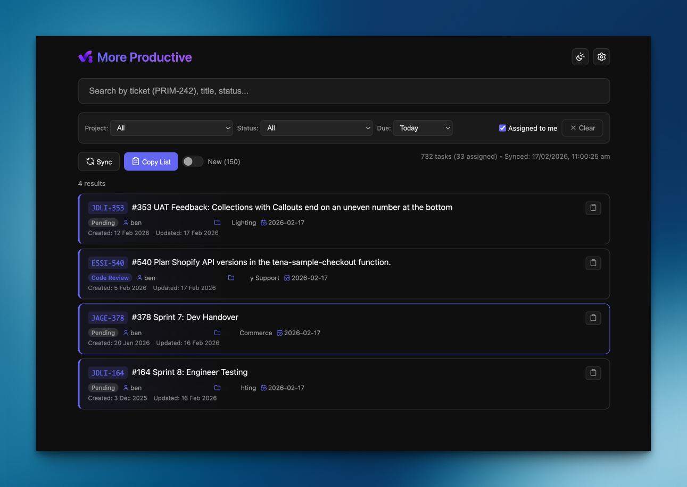
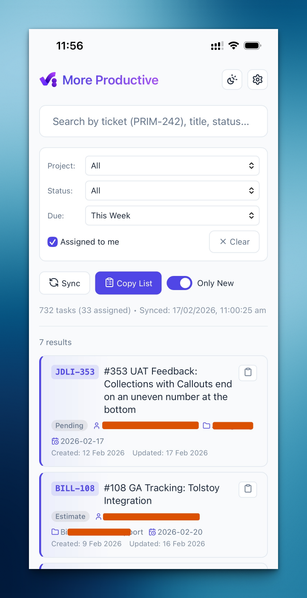

# Better Productive.io

A fast, searchable task dashboard for [Productive.io](https://productive.io) built as a Cloudflare Worker. Features Jira-style ticket URLs (`/browse/PRIM-242`), powerful filtering, and markdown export.





## ✨ Features

- **🔍 Fast Search** - Search across all tasks by ticket number, title, status, or assignee
- **🎫 Jira-style URLs** - Access tasks via `/browse/PRIM-242` style URLs
- **🎯 Smart Filtering** - Filter by project, status, due date, and assignee
- **📋 Markdown Export** - Copy filtered tasks as markdown checklists
- **🌙 Dark/Light Mode** - Toggle between themes
- **⚡ Real-time Sync** - SSE-powered progress with auto-sync during business hours
- **🔐 Secure** - PIN protection with credentials stored as Cloudflare Secrets
- **⚙️ Settings UI** - Update credentials and customize via web interface

## 🚀 Quick Start

### Prerequisites

- [Node.js](https://nodejs.org/) (v22+)
- [Wrangler CLI](https://developers.cloudflare.com/workers/wrangler/install-and-update/) (`npm install -g wrangler`)
- A [Productive.io](https://productive.io) account with API access (check Account avatar > Settings > API integrations)

### Setup

1. **Clone the repository**
   ```bash
   git clone git@github.com:benjaminv/better-productive.git
   cd better-productive
   npm install
   ```

2. **Copy the config templates**
   ```bash
   cp wrangler.toml.example wrangler.toml
   cp .dev.vars.example .dev.vars
   ```

3. **Create a KV namespace**
   ```bash
   wrangler kv namespace create TASKS_KV
   ```
   Copy the output ID into `wrangler.toml`:
   ```toml
   [[kv_namespaces]]
   binding = "TASKS_KV"
   id = "your-namespace-id-here"
   ```

4. **Choose your credential method** (see [Deployment Options](#-deployment-options) below)

5. **Deploy!**
   ```bash
   npm run deploy
   ```

## 🛠️ Development

### Local Development

1. Edit `.dev.vars` with your credentials:
   ```bash
   PRODUCTIVE_API_TOKEN=your_token_here
   APP_PIN=1234
   ```

2. Start the dev server:
   ```bash
   npm run dev
   ```

3. Open http://localhost:8787

> **Note**: Local development uses a SQLite emulation of KV, not your production Cloudflare KV. Use `wrangler dev --remote` to connect to production KV.

### Project Structure

```
src/
├── index.js          # Worker logic, API routes, SSE streaming
├── template.html     # HTML + JavaScript (Settings modal, sync UI)
├── auth.html         # Login/setup pages
├── styles.css        # CSS styles
└── assets/           # Logo and favicons
```

## 📦 Deployment Options

You have **two options** for managing credentials:

### Option A: Cloudflare Secrets (Recommended)

Best for: Security-conscious deployments, admin-controlled credentials

```bash
# Set your API token
wrangler secret put PRODUCTIVE_API_TOKEN

# Set your PIN (4-8 digits)
wrangler secret put APP_PIN
```

- ✅ Credentials are encrypted and hidden
- ✅ Cannot be changed via Settings UI
- ✅ No data visible in KV storage

### Option B: Settings UI + KV Storage

Best for: Easy setup, no CLI required, self-managed deployments

1. Deploy without setting secrets
2. Visit your Worker URL
3. Complete the setup wizard (API token + PIN required)
4. Credentials are stored in Cloudflare KV

- ✅ No CLI required
- ✅ Users can update via Settings UI
- ⚠️ Data stored in KV (readable via dashboard)

### Credential Priority

When both options are configured, **Secrets take priority**:

| Secret Set? | KV Set? | Which is Used? |
|:-----------:|:-------:|:--------------:|
| ✅ | ✅ | **Secret** (KV ignored) |
| ✅ | ❌ | Secret |
| ❌ | ✅ | KV |
| ❌ | ❌ | Setup wizard shown |

## ⚙️ Configuration

### Environment Variables

| Variable | Description | Required |
|----------|-------------|----------|
| `PRODUCTIVE_API_TOKEN` | Your Productive.io API token | Yes* |
| `APP_PIN` | 4-8 digit PIN for dashboard access | Yes* |
| `PRODUCTIVE_ORG_ID` | Organization ID | Auto-detected |
| `PRODUCTIVE_ORG_SLUG` | Organization slug for URLs | Auto-detected |
| `PRODUCTIVE_PERSON_ID` | Your person ID for "Assigned to me" | Auto-detected |

*Can be set via Secrets OR Settings UI

### Settings UI

Click the ⚙️ gear icon to access:

- **Page Title** - Customize the dashboard name
- **PIN** - Update access PIN (if not using Secrets)
- **API Token** - Update Productive.io token (if not using Secrets)
- **Logout** - End current session

### Cron Schedule

By default, tasks sync hourly during AEDT business hours (Mon-Fri 7am-7pm). Adjust in `wrangler.toml`:

```toml
[triggers]
crons = [
  "0 20-23 * * SUN-THU",  # 7-10 AM AEDT
  "0 0-8 * * MON-FRI"     # 11 AM-7 PM AEDT
]
```

## 📖 API Routes

| Route | Description |
|-------|-------------|
| `GET /` | Search UI |
| `GET /browse/PRIM-242` | Redirect to Productive.io task |
| `GET /api/search?q=text` | Search tasks (JSON) |
| `GET /api/filters` | Get available filters |
| `GET /api/settings` | Update settings (POST) |
| `GET /update` | Trigger manual sync (SSE stream) |
| `GET /login` | Login page |
| `GET /logout` | End session |

## 🔒 Security

- **Secrets** - API token and PIN can be stored as [Cloudflare Secrets](https://developers.cloudflare.com/workers/configuration/secrets/)
- **PIN Hashing** - PINs stored in KV are hashed with SHA-256
- **Session Cookies** - Secure, HTTP-only cookies for authentication
- **Never commit** `.dev.vars` (it's in `.gitignore`)
- For additional access control, consider [Cloudflare Access](https://developers.cloudflare.com/cloudflare-one/applications/)

## 📝 License

MIT License - see [LICENSE](LICENSE) for details.

## 🙏 Acknowledgments

- Built with [Cloudflare Workers](https://workers.cloudflare.com/)
- Task data from [Productive.io API](https://developer.productive.io/)

## 🗺️ Roadmap

### Completed
- [x] Fetch tasks from Productive.io (subscribed + assigned)
- [x] Search by ticket key, number, title, status, or assignee
- [x] Filter by project, status, due date, and "assigned to me"
- [x] Automatic project prefix generation (e.g., `PRIM-242`)
- [x] Copy individual task as Markdown link
- [x] Copy filtered tasks as Markdown with project groupings
- [x] Pagination with keyboard navigation
- [x] PIN authentication with session management
- [x] Auto-detection of organisation and person ID from API token
- [x] Real-time sync progress with Server-Sent Events
- [x] "What's New" highlighting for changed tasks since last manual sync
- [x] Cancel in-progress sync
- [x] Dark/light theme toggle
- [x] PWA support (installable app)
- [x] Settings modal (title, PIN, API token)
- [x] Sync cooldown rate limiting
- [x] Scheduled background sync (cron)
- [x] Preserve deleted/unsubscribed tasks
- [x] Sort by project, due date, created, updated
- [x] Exclude Resolved filter (Done/Cancel/Closed/Unknown)

### Planned

- [ ] Keyboard shortcuts reference
- [ ] Webhook support for instant sync on Productive.io changes
- [ ] Sync single or batch tickets (pull current data of single ticket, no full sync needed)
- [ ] Sync batch tickets (pull current data of a batch of selected tickets, no full sync needed)

### Considering
- [ ] Browser notifications for new tasks
- [ ] Task status quick-actions (without leaving the dashboard)
- [ ] Time tracking integration
- [ ] Multi-user support (separate data per API token)
- [ ] Team view (see colleagues' assigned tasks)
- [ ] Custom project prefix overrides

---

*This project is not affiliated with Productive.io.*
